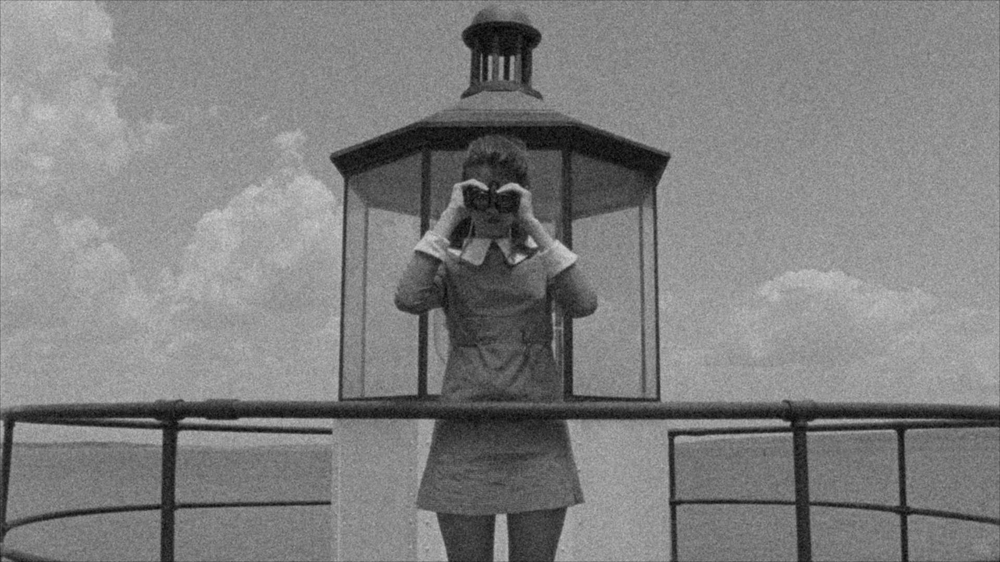
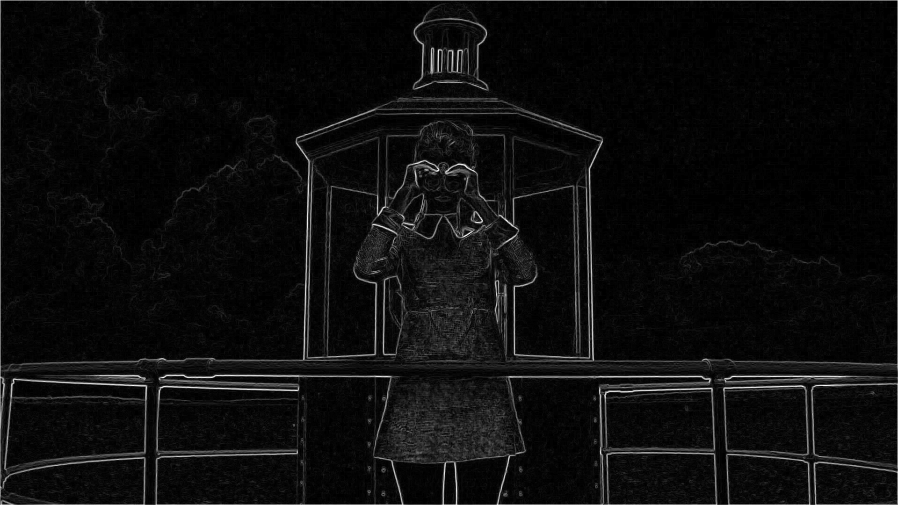
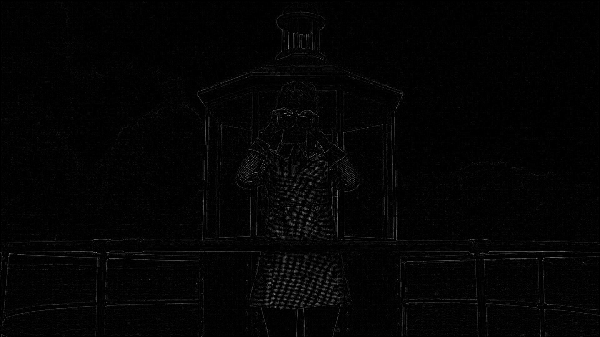

# image-processing-from-scratch
This project implements basic image processing operations from scratch using NumPy.  
It was developed as part of a Computer Vision assignment in my master's program.

## Features
- Grayscale conversion  
- 2D convolution  
- Gaussian and salt & pepper noise  
- Mean and median filtering  
- Edge detection (Sobel, Prewitt, Laplacian)

## Requirements
To run the project, you’ll need:

- NumPy: For numerical operations and matrix manipulation.

- OpenCV: For image reading, displaying, and saving.

---

## 📘 Theory

### 🔹 2D Convolution
2D convolution is a mathematical operation used to apply a kernel (or filter) over an image to extract features or perform transformations.  
For each pixel, the kernel is multiplied element-wise with the local neighborhood and summed to produce the output.  

Mathematically:

$$ G(x, y) = \sum_{i=-k}^{k} \sum_{j=-k}^{k} F(x-i, y-j) \cdot H(i, j) $$

Where:  
- \(F(x, y)\) → input image  
- \(H(i, j)\) → kernel/filter  
- \(G(x, y)\) → output image after convolution

---

### 🔹 Image Filtering
Filtering smooths or enhances images by modifying pixel intensity values:
- **Mean filter:** Averages pixel values in a neighborhood → reduces Gaussian noise.  
- **Median filter:** Takes the median of neighborhood pixels → removes salt-and-pepper noise effectively.  

These filters are often applied before edge detection to reduce noise and improve results.

---

### 🔹 Edge Detection
Edges represent regions of rapid intensity change. These edges represent important features like object boundaries.Different operators detect edges by approximating gradients:

- **Sobel operator:** Uses weighted differences to emphasize central pixels. It’s sensitive to horizontal and vertical edges.  
- **Prewitt operator:** Simpler gradient approximation using uniform weights.  
- **Laplacian operator:** Computes the second derivative of the image. It detects rapid intensity changes in all directions, highlighting edges.

---

## 🧪 Results

### Original and Grayscale
The first step in most image processing pipelines is converting the image to grayscale. This simplifies further operations like edge detection and filtering.
| Original | Grayscale |
|-----------|------------|
|  |  |

### Addition of Noise
| Gaussian Noise | Salt & Pepper Noise |
|----------------|---------------------|
|  |  |

### Filtered Images
Filtering images after applying noise. Using kernel, window_size = 3 .
| Mean Filter | Median Filter |
|--------------|----------------|
|  |  |

### Edge Detection
| Sobel | Prewitt | Laplacian |
|--------|----------|------------|
|  |  |  |

